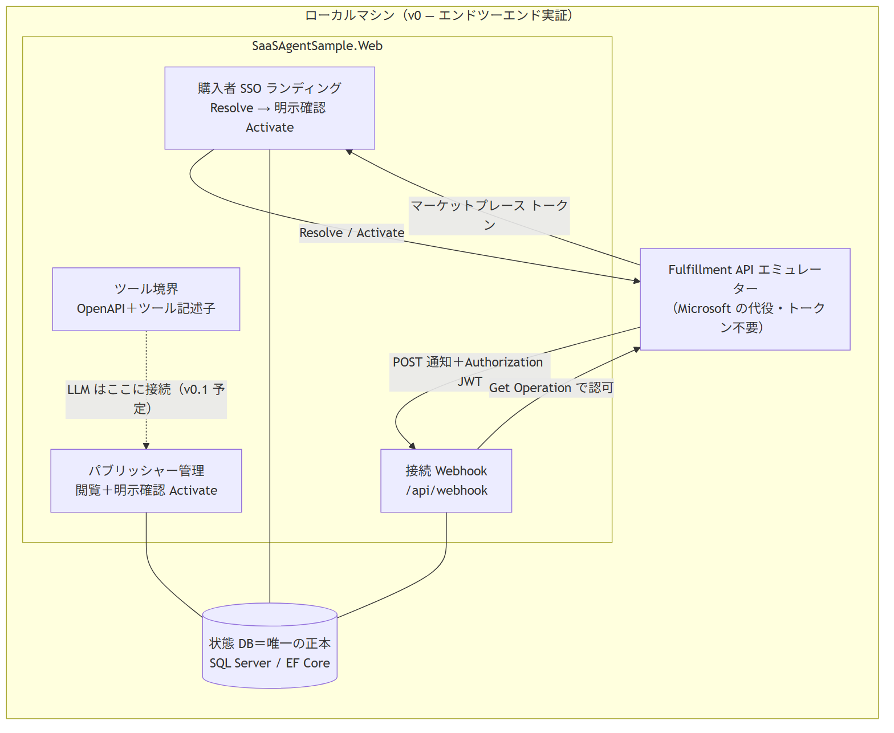

# marketplace-saas-agent-sample

> **実験的な教材サンプル（作成中）。** Microsoft 商用マーケットプレースの **SaaS Offer** を
> **Tier-1 定額（flat-rate）**（購読ごとに月額固定価格を1つ設定するモデル — 従量課金・ユーザー数課金なし）
> ・**.NET 10** で公開・運用するための、エージェント対応リファレンス実装です。
> 本番利用は想定していません。

> 🌐 English README: **[README.md](README.md)**

エージェント支援による SaaS Offer フルフィルメント：購入者向けの **SSO ランディングページ**
（Resolve → 明示確認のうえ Activate）、**接続 Webhook**、**権威ある購読状態ストア**、
**最小限のパブリッシャー管理画面** を備え、その手前に言語非依存の **ツール境界**（LLM や
エージェントが後から呼び出せる OpenAPI サーフェス）を置くことで、**フルフィルメント層**
（ランディングページ・Webhook・状態ストアから成るパブリッシャー側の実装）を書き換えずに
後から LLM/エージェント層を追加できます。公式の
[SaaS Accelerator](https://github.com/Azure/Commercial-Marketplace-SaaS-Accelerator)（MIT）は
参照実装として利用し（fork しません）、
[Fulfillment API Emulator](https://github.com/microsoft/Commercial-Marketplace-SaaS-API-Emulator)（MIT）で
実購入なしに Resolve/Activate/Webhook を駆動します。

marketplace SaaS が初めての方は、まず **[体験ウォークスルー（docs/walkthrough.ja.md）](docs/walkthrough.ja.md)** から。
購入者・パブリッシャーそれぞれの「誰が何をするか」を平易に地図化し、本サンプルの実装に対応づけています。

## 用語（Terminology）

| 用語 | 意味 |
| --- | --- |
| **Tier-1 定額（flat-rate）** | Microsoft の価格モデルの1つ。購読ごとに月額固定価格を1つ設定（従量課金・ユーザー数課金なし）。 |
| **フルフィルメント層** | パブリッシャー側の SaaS 実装：ランディングページ・接続 Webhook・購読状態ストア。 |
| **ツール境界** | LLM やエージェントがパブリッシャー操作を呼び出せる OpenAPI サーフェス（＋ツール記述子）。 |
| **v0** | 本サンプルの初期バージョン — 全コンポーネントをローカルで動作させ、LLM エージェントループはまだなし。 |
| **v0.1** | 次のマイルストーン（予定）：v0 の上に LLM エージェントループを追加。 |
| **L2 ウォークスルー** | 統合レベルのエンドツーエンド実証：実 HTTP 上で全購読ライフサイクルを駆動（エミュレーター使用）。 |
| **合成 L2（Synthetic L2）** | 自動化 in-repo バリアント：Docker エミュレーターを in-process HTTP スタブで置換（Docker 不要）。 |

## アーキテクチャ（v0 — 初期バージョン、完全にローカルで動作）

<!-- GitHub の Mermaid は日本語ラベルを見切れさせるため、PNG を事前生成して埋め込み。ソース: docs/images/ja-architecture.mmd -->


## ソリューション構成

| プロジェクト | 役割 |
| --- | --- |
| `src/SaaSAgentSample.Core` | ドメインモデル（購読・状態・プラン）。インフラ非依存 |
| `src/SaaSAgentSample.Data` | EF Core の状態ストア（唯一の正本）。SQL Server / Azure SQL |
| `src/SaaSAgentSample.Fulfillment` | Fulfillment/Operations API v2 クライアント＋Webhook 検証（サーバー側） |
| `src/SaaSAgentSample.Web` | 購入者 SSO ランディング・接続 Webhook・パブリッシャー管理・ツール境界 |
| `tests/SaaSAgentSample.Tests` | ユニット＋統合（エンドツーエンドエミュレーション）テスト — [L2 ウォークスルー](#l2-ウォークスルー合成フルフィルメントライフサイクル) 参照 |

## 前提条件

- [.NET 10 SDK](https://dotnet.microsoft.com/download/dotnet/10.0)
- 状態ストア用のデータベース（ホストのアーキテクチャに応じて選択）：
  - **x86-64（Linux / macOS Intel / Windows x64）**：同梱の `docker-compose.yml` を使い
    [Docker](https://www.docker.com/) で **SQL Server**（イメージ
    `mcr.microsoft.com/mssql/server:2022-latest`）。SQL Server が**権威あるデータベース**で、
    スキーマは EF Core マイグレーションでバージョン管理されます。
  - **arm64（Apple Silicon・Windows-on-ARM・Linux arm64）**：`Microsoft.EntityFrameworkCore.Sqlite`
    プロバイダで **SQLite**（スキーマは `EnsureCreated` でミラー、マイグレーションなし）。
    ローカル開発専用です。
  - **Windows x64（Docker なし）**：SQL Server **LocalDB**。フル SQL Server と同じ接続文字列の
    切り替えで動作します。
- エンドツーエンドウォークスルー（以下「L2 ウォークスルー」と呼ぶ — 統合レベルの実証：
  トークン不要のエミュレーターを Microsoft の代役として実 HTTP 上で全購読ライフサイクルを
  駆動）用の Fulfillment API Emulator — [docs/l2-demo.ja.md](docs/l2-demo.ja.md) 参照。
  自動テストは Docker なしで CI 上でも実行され、手動手順では `docker-compose.yml` で
  エミュレーターコンテナを起動します。

### ローカル SQL Server の起動（x86-64）

```bash
cp .env.example .env       # then edit MSSQL_SA_PASSWORD to a strong value
docker compose up -d sqlserver
```

### データベースプロバイダの切り替え

以下の設定キー（`appsettings.Development.json` または環境変数）でプロバイダを選択します：

| `Database:Provider` | `Database:ConnectionString` の例 |
| --- | --- |
| `SqlServer`（既定） | `Server=localhost,1433;Database=SaasAgentSample;User Id=sa;<password>;TrustServerCertificate=True;` |
| `Sqlite` | `Data Source=./saas-agent-sample.db` |
| `InMemory` | *(無視される — テスト専用)* |

起動時、SQL Server 系では `DbContext.Database.Migrate()`（権威あるマイグレーションは
`src/SaaSAgentSample.Data/Persistence/Migrations/`）が実行されます。SQLite 系では
`DbContext.Database.EnsureCreated()` が実行され、arm64 開発者は別途マイグレーション履歴を
維持せずに反復開発できます。

## ビルドとテスト

```bash
dotnet build SaaSAgentSample.slnx
dotnet test SaaSAgentSample.slnx
```

既定のテスト実行は SQLite / InMemory 経路のみを対象にします。SQL Server 統合テストも
ローカルで実行するには、上記の compose サービスを起動し、接続文字列をエクスポートします：

```bash
export SQL_SERVER_CONNECTION='Server=localhost,1433;Database=SaasAgentSample;User Id=sa;<your MSSQL_SA_PASSWORD>;TrustServerCertificate=True;'
dotnet test SaaSAgentSample.slnx
```

## アプリの起動

```bash
dotnet run --project src/SaaSAgentSample.Web
```

既定では `Development` 環境で動作します：SQLite 状態ストア、購入者サインイン無効
（`Landing:RequireAuthentication=false`）、Fulfillment クライアントはローカルエミュレーター向け、
未署名 Webhook トークンを受理 — つまり Entra も実購入もなしで一連のフローがローカルで動きます。
エンドポイント：

| パス | 内容 |
| --- | --- |
| `/?token=<purchase-token>` | 購入者 SSO ランディング（Resolve → 明示確認 Activate） |
| `/admin`, `/admin/{id}` | パブリッシャー管理（閲覧＋明示確認 Activate） |
| `POST /api/webhook` | 接続 Webhook（サーバー側で Entra JWT ＋ Get Operation 検証） |
| `/api/subscriptions`, `/api/subscriptions/{id}` | ツール境界 — 状態の読み取り（JSON） |
| `POST /api/subscriptions/{id}/activate` | ツール境界 — Activate（`confirm=true` が必須） |
| `/api/tools` | ツール記述子（function-calling スキーマ） |
| `/openapi/v1.json` | ツール境界の OpenAPI ドキュメント |

## 設定リファレンス

`appsettings*.json`・環境変数（ネストキーは `__`）・App Service 設定からバインドします。
シークレットは**プレースホルダのみ**。実値をコミットしないでください。

| キー | 目的 | ローカル既定 |
| --- | --- | --- |
| `Database:Provider` | `SqlServer` \| `Sqlite` \| `InMemory` | `Sqlite` |
| `Database:ConnectionString` | 状態ストアの接続 | SQLite ファイル |
| `Landing:RequireAuthentication` | ランディング/管理で Entra サインインを必須にする | `false`（dev） |
| `AzureAd:*` | 購入者サインイン用アプリ（マルチテナント・authority `common`） | プレースホルダの client id |
| `Fulfillment:BaseUrl` | Fulfillment API のベース（`/api` を含む） | エミュレーター |
| `Fulfillment:ApiVersion` | API バージョン | `2018-08-31` |
| `Fulfillment:Webhook:Audience` | 期待する JWT audience = パブリッシャーアプリの client id | プレースホルダ |
| `Fulfillment:Webhook:ExpectedAppId` | 期待する `appid`/`azp` クレーム | 公開 Marketplace アプリ ID |
| `Fulfillment:Webhook:MetadataAddress` | 署名鍵取得用の Entra OpenID メタデータ | — |
| `Fulfillment:Webhook:RequireSignedToken` | JWT 署名を必須にする（**本番では true**） | `false`（dev） |

## L2 ウォークスルー（合成フルフィルメント・ライフサイクル）

**「L2」** とは統合レベルのエンドツーエンド実証を指します：アプリが実 HTTP 上で
フルフィルメント API（エミュレーター）と通信し、全購読ライフサイクルを駆動します。
**「合成（Synthetic）」** とは、実際のマーケットプレース購入の代わりにエミュレーターまたは
in-repo HTTP スタブを使うことを意味します。

トークン不要のエミュレーターを Microsoft の代役として使い、実購入なしで
Resolve → Activate → Webhook → 状態遷移までを通しで実証します。自動テストは実 HTTP で
全ライフサイクルを駆動し（Docker なしで CI 上でも実行）、手動手順では実エミュレーターを
Docker で起動します。詳細は **[docs/l2-demo.ja.md](docs/l2-demo.ja.md)**。

```bash
dotnet test --filter FullyQualifiedName~SyntheticL2LifecycleTests
```

## ガードレール（厳守）

- **状態 DB が唯一の正本**。モデルがエンタイトルメントや状態を捏造することはありません。
- **状態を変更する操作には明示的な確認が必須**です。
- **購入/ベアラートークン・シークレット・不要な PII** をモデルのコンテキストやログに入れません。
- **Webhook の Authorization 検証はサーバー側**（Entra JWT ＋ Get Operation）で行い、
  モデルには一切委譲しません。

## デプロイ

対象：Azure **App Service**（.NET 10）＋ **Azure SQL**（リージョン **West US 3**）。アプリは
マネージド ID による **パスワードレス**接続でデータベースに接続します（接続文字列にシークレットなし）。
プロビジョニングは**人間の承認がある場合のみ**で、エージェントは実行しません。

プロビジョニング・マネージド ID による SQL アクセス・アプリ設定・デプロイ・マーケットプレース
オファーのランディングページと接続 Webhook の配線を含む完全な手順は
**[docs/deploy.ja.md](docs/deploy.ja.md)** にあります。

## 参考リンク

- SaaS fulfillment APIs: <https://learn.microsoft.com/en-us/partner-center/marketplace-offers/pc-saas-fulfillment-apis>
- SaaS subscription life cycle: <https://learn.microsoft.com/en-us/partner-center/marketplace-offers/pc-saas-fulfillment-life-cycle>
- Implementing a webhook (JWT validation + Get Operation): <https://learn.microsoft.com/en-us/partner-center/marketplace-offers/pc-saas-fulfillment-webhook>
- Register a SaaS application: <https://learn.microsoft.com/en-us/partner-center/marketplace-offers/pc-saas-registration>
- Deploy an ASP.NET web app to App Service: <https://learn.microsoft.com/en-us/azure/app-service/quickstart-dotnetcore>
- Connect .NET apps to Azure SQL with managed identity: <https://learn.microsoft.com/en-us/azure/app-service/tutorial-connect-msi-sql-database>
- What is Azure SQL Database: <https://learn.microsoft.com/en-us/azure/azure-sql/database/sql-database-paas-overview?view=azuresql>
- .NET lifecycle (.NET 10 supported to 2028-11-14): <https://learn.microsoft.com/en-us/lifecycle/products/microsoft-net-and-net-core>

## ライセンス

[MIT](LICENSE).
