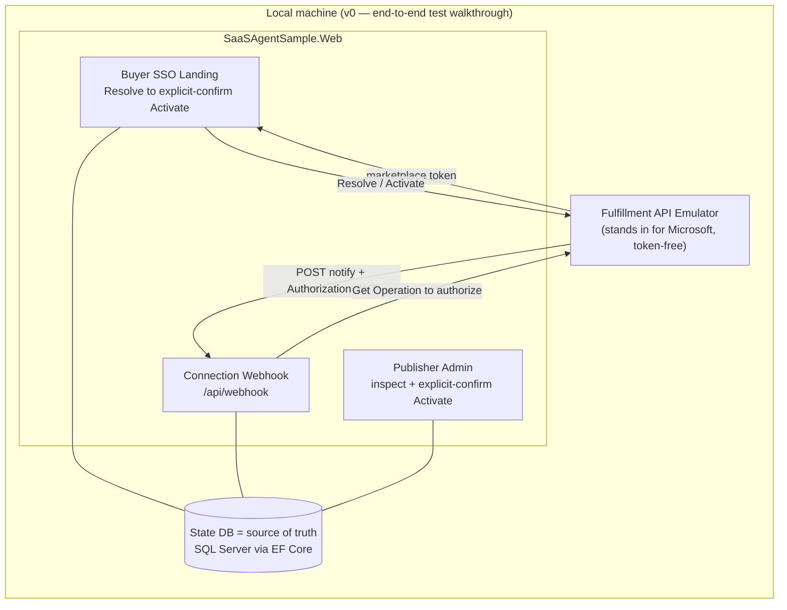

# marketplace-saas-agent-sample

> **Experimental teaching sample — work in progress. Not for production use.**
> A small, readable reference for publishing and operating a **Microsoft Commercial
> Marketplace SaaS Offer** at Tier-1 flat-rate on .NET 10.

> 🌐 日本語版の README は **[README.ja.md](README.ja.md)** をご覧ください。

This sample implements the *publisher side* of a marketplace SaaS subscription — the
"fulfillment plane" that keeps a subscription in sync with Microsoft:

- a buyer **SSO landing page** (Resolve → explicit-confirm Activate),
- a **connection webhook** (validated server-side),
- an **authoritative subscription-state store**, and
- a **minimal publisher admin** page.

It runs entirely on your machine. The official
[SaaS Accelerator](https://github.com/Azure/Commercial-Marketplace-SaaS-Accelerator) (MIT)
is used as a reference (not forked), and the
[Fulfillment API Emulator](https://github.com/microsoft/Commercial-Marketplace-SaaS-API-Emulator) (MIT)
stands in for the marketplace, so no real purchase is needed.

**New to marketplace SaaS?** Start with the [experience walkthrough](docs/walkthrough.md) —
a plain-language map of who does what, and how it maps to the code here.

## Quickstart

You only need the [.NET 10 SDK](https://dotnet.microsoft.com/download/dotnet/10.0).
No Docker, no Azure, no marketplace purchase.

```bash
git clone https://github.com/MamoruKuroda/marketplace-saas-agent-sample
cd marketplace-saas-agent-sample

# Prove the whole subscription lifecycle end to end
# (Resolve → Activate → webhook → state), all over local HTTP:
dotnet test --filter FullyQualifiedName~SyntheticL2LifecycleTests

# …or run the app and open the publisher admin page:
dotnet run --project src/SaaSAgentSample.Web
#   → http://localhost:5134/admin
```

In development the app uses a local SQLite store, sign-in is off, and the fulfillment
client points at the emulator — so the whole flow works with nothing else installed. To
drive the buyer landing page with a real purchase token, follow the
[end-to-end walkthrough](docs/l2-demo.md).

<details>
<summary>Terminology (v0, L2, Tier-1…)</summary>

| Term | Meaning |
| --- | --- |
| **Tier-1 flat-rate** | A Microsoft pricing model: one fixed monthly price per subscription (no metered or per-user billing). |
| **Fulfillment plane** | The publisher side: landing page, connection webhook, and subscription-state store. |
| **v0** | This first version of the sample — everything runs locally. |
| **L2** | An integration-level end-to-end proof: the app talks to a fulfillment API over real HTTP (emulated) and runs the full subscription lifecycle. |
| **Synthetic L2** | The automated in-repo variant — an HTTP stub replaces the Docker emulator, so no Docker is needed. |

</details>

## Architecture

Everything in v0 runs on one machine.



## Solution layout

| Project | Purpose |
| --- | --- |
| `src/SaaSAgentSample.Core` | Domain model (subscription, state, plan); infrastructure-agnostic |
| `src/SaaSAgentSample.Data` | EF Core state store (single source of truth); SQL Server / Azure SQL |
| `src/SaaSAgentSample.Fulfillment` | Fulfillment/Operations API v2 client + server-side webhook validation |
| `src/SaaSAgentSample.Web` | Buyer SSO landing, connection webhook, publisher admin |
| `tests/SaaSAgentSample.Tests` | Unit + integration (synthetic end-to-end) tests |

## Running it locally

The Quickstart above is all you need to see it work. This section fills in the details.

### Prerequisites

- The [.NET 10 SDK](https://dotnet.microsoft.com/download/dotnet/10.0).
- A state-store database. `dotnet run` defaults to **SQLite**, so nothing extra is needed
  to start. For the SQL Server path (the authoritative store), pick the row for your host:

  | Host | Database | How |
  | --- | --- | --- |
  | x86-64 (Linux / Intel Mac / Windows x64) | SQL Server | Docker, via the bundled `docker-compose.yml` |
  | arm64 (Apple Silicon, Windows-on-ARM) | SQLite | built-in provider, local dev only |
  | Windows x64, no Docker | SQL Server LocalDB | same connection-string switch |

- For the Docker-based end-to-end path, the [Fulfillment API Emulator](docs/l2-demo.md).
  (The automated proof needs no Docker.)

<details>
<summary>Database provider switch & migrations</summary>

Select the provider with these keys (in `appsettings.Development.json` or env vars):

| `Database:Provider` | `Database:ConnectionString` example |
| --- | --- |
| `SqlServer` (default) | `Server=localhost,1433;Database=SaasAgentSample;User Id=sa;******;TrustServerCertificate=True;` |
| `Sqlite` | `Data Source=./saas-agent-sample.db` |
| `InMemory` | *(ignored — used only for tests)* |

Start a local SQL Server on x86-64 (image `mcr.microsoft.com/mssql/server:2022-latest`):

```bash
cp .env.example .env       # then set MSSQL_SA_PASSWORD to a strong value
docker compose up -d sqlserver
```

On startup the SQL Server path runs `DbContext.Database.Migrate()` (authoritative
migrations in `src/SaaSAgentSample.Data/Persistence/Migrations/`); the SQLite path runs
`EnsureCreated()`, so arm64 developers can iterate without a separate migration history.

</details>

### Build & test

```bash
dotnet build SaaSAgentSample.slnx
dotnet test SaaSAgentSample.slnx
```

The default test run covers the SQLite / InMemory paths only.

<details>
<summary>Also running the SQL Server integration tests</summary>

Start the compose service above, then export a connection string:

```bash
export SQL_SERVER_CONNECTION='Server=localhost,1433;Database=SaasAgentSample;User Id=sa;<your MSSQL_SA_PASSWORD>;TrustServerCertificate=True;'
dotnet test SaaSAgentSample.slnx
```

</details>

### Run the app

```bash
dotnet run --project src/SaaSAgentSample.Web
```

The `Development` environment uses the SQLite store, disables buyer sign-in
(`Landing:RequireAuthentication=false`), points the fulfillment client at the local
emulator, and accepts unsigned webhook tokens — so the whole flow works without Entra or a
real purchase.

| Path | What it is |
| --- | --- |
| `/?token=<purchase-token>` | Buyer SSO landing (Resolve → explicit-confirm Activate) |
| `/admin`, `/admin/{id}` | Publisher admin (inspect + explicit-confirm Activate) |
| `POST /api/webhook` | Connection webhook (server-side Entra JWT + Get Operation) |

<details>
<summary>Configuration reference</summary>

Bind from `appsettings*.json`, environment variables (`__` for nested keys), or App
Service settings. Secrets are **placeholders only** — never commit real values.

| Key | Purpose | Local default |
| --- | --- | --- |
| `Database:Provider` | `SqlServer` \| `Sqlite` \| `InMemory` | `Sqlite` |
| `Database:ConnectionString` | State store connection | SQLite file |
| `Landing:RequireAuthentication` | Require Entra sign-in for landing/admin | `false` (dev) |
| `AzureAd:*` | Buyer sign-in app (multitenant; authority `common`) | placeholder client id |
| `Fulfillment:BaseUrl` | Fulfillment API base (incl. `/api`) | emulator |
| `Fulfillment:ApiVersion` | API version | `2018-08-31` |
| `Fulfillment:Webhook:Audience` | Expected JWT audience = publisher app client id | placeholder |
| `Fulfillment:Webhook:ExpectedAppId` | Expected `appid`/`azp` claim | public Marketplace app id |
| `Fulfillment:Webhook:MetadataAddress` | Entra OpenID metadata for signing keys | — |
| `Fulfillment:Webhook:RequireSignedToken` | Enforce JWT signature (**true in prod**) | `false` (dev) |

</details>

## Prove it end to end (L2)

Run the whole fulfillment lifecycle — Resolve → Activate → webhook → state — with no real
purchase. The emulator stands in for Microsoft over real HTTP. An automated test does this
in CI with no Docker; a manual path runs the real emulator in Docker.

```bash
dotnet test --filter FullyQualifiedName~SyntheticL2LifecycleTests
```

Full details, including the manual emulator path: [docs/l2-demo.md](docs/l2-demo.md).

## Guardrails

A few rules this sample never breaks:

- The state DB is the single source of truth; subscription state comes only from the store
  and the Fulfillment API — the app never invents it.
- State-changing actions require explicit confirmation.
- No purchase/bearer tokens, secrets, or unnecessary PII in logs.
- Webhook Authorization is validated server-side (Entra JWT + Get Operation).

## Deploy

The production target is Azure App Service (.NET 10) + Azure SQL in West US 3, with the app
connecting to the database passwordless via managed identity. Provisioning is
human-authorized only — nothing here deploys automatically.

The full walkthrough — provision, managed-identity SQL access, app settings, deploy, and
wiring the offer's landing page + connection webhook — is in [docs/deploy.md](docs/deploy.md).

## Further reading

- SaaS fulfillment APIs: <https://learn.microsoft.com/en-us/partner-center/marketplace-offers/pc-saas-fulfillment-apis>
- SaaS subscription life cycle: <https://learn.microsoft.com/en-us/partner-center/marketplace-offers/pc-saas-fulfillment-life-cycle>
- Implementing a webhook (JWT validation + Get Operation): <https://learn.microsoft.com/en-us/partner-center/marketplace-offers/pc-saas-fulfillment-webhook>
- Register a SaaS application: <https://learn.microsoft.com/en-us/partner-center/marketplace-offers/pc-saas-registration>
- Deploy an ASP.NET web app to App Service: <https://learn.microsoft.com/en-us/azure/app-service/quickstart-dotnetcore>
- Connect .NET apps to Azure SQL with managed identity: <https://learn.microsoft.com/en-us/azure/app-service/tutorial-connect-msi-sql-database>
- What is Azure SQL Database: <https://learn.microsoft.com/en-us/azure/azure-sql/database/sql-database-paas-overview?view=azuresql>
- .NET lifecycle (.NET 10 supported to 2028-11-14): <https://learn.microsoft.com/en-us/lifecycle/products/microsoft-net-and-net-core>

## License

[MIT](LICENSE).
