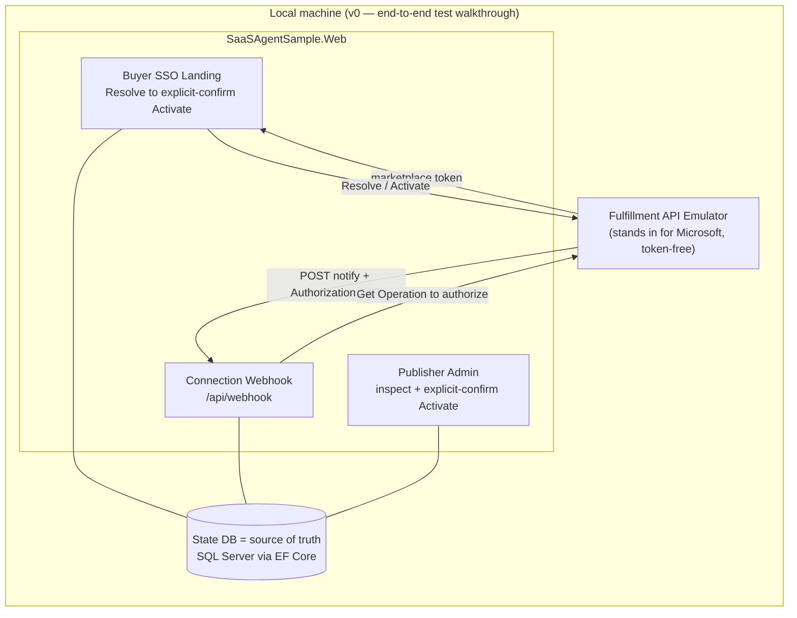

# marketplace-saas-agent-sample

> **Experimental teaching sample — work in progress. Not for production use.**
> A small, readable reference for publishing and operating a **Microsoft Commercial
> Marketplace SaaS Offer** at Tier-1 flat-rate on .NET 10.

> 🌐 日本語版の README は **[README.ja.md](README.ja.md)** をご覧ください。

This sample implements the *publisher side* of a marketplace SaaS subscription — the
"fulfillment plane" that keeps a subscription in sync with Microsoft:

- a buyer **SSO landing page** (Resolve → explicit-confirm Activate),
- a **connection webhook** (validated server-side),
- an **authoritative subscription-state store**, and
- a **minimal publisher admin** page.

You can run it two ways: deploy a **cloud demo** to Azure with one command, or run it entirely
**on your machine** (no Azure). The official
[SaaS Accelerator](https://github.com/Azure/Commercial-Marketplace-SaaS-Accelerator) (MIT)
is used as a reference (not forked), and the
[Fulfillment API Emulator](https://github.com/microsoft/Commercial-Marketplace-SaaS-API-Emulator) (MIT)
stands in for the marketplace, so no real purchase is needed.

**New to marketplace SaaS?** Start with the [experience walkthrough](docs/walkthrough.md) —
a plain-language map of who does what, and how it maps to the code here.

## Two ways to run it

| | **Deploy a cloud demo** | **Run locally** |
| --- | --- | --- |
| For | a live URL others can click through the full lifecycle | developing, testing, trying it out |
| Command | `azd up` | `dotnet run` / `dotnet test` |
| State store | **Azure SQL** — the authoritative store, reached passwordless via managed identity | **SQLite** — zero setup, runs on any machine (incl. arm64) |
| Azure needed? | Yes (an Azure subscription) | No |

SQLite is the *local development* store (nothing to install, runs anywhere); Azure SQL is the
*authoritative* store used in the cloud. Same app, same code — only `Database:Provider` differs.

### Deploy a cloud demo (azd)

One command provisions Azure and deploys three things — the **app**, its **Azure SQL** state
store, and the **Fulfillment API Emulator** (Microsoft's token-free marketplace stand-in, on
Azure Container Apps). The result is a live URL anyone can click through the whole subscription
lifecycle — no local setup, no real purchase. This is the automated version of the step-by-step
[docs/deploy.md](docs/deploy.md). New to `azd`? See the
[Azure Developer CLI docs](https://learn.microsoft.com/en-us/azure/developer/azure-developer-cli/overview).

```bash
# one-time: install the Azure Developer CLI (https://aka.ms/azd-install),
# the Azure CLI, and sqlcmd; then sign in:
azd auth login

azd up      # pick an environment name, subscription, and region
            # → provisions App Service + Azure SQL + the emulator (Container Apps)
            # → deploys everything (a few minutes), then prints the app and emulator URLs

azd down    # remove everything when you're done
```

Buyer sign-in is **off** by default, so there's nothing to configure. `azd up` prints an
**Endpoint** URL for each service — the **emulator** and the **app** (run `azd show` to see them
again). Open the emulator endpoint and drive the whole lifecycle from the browser:

1. On the **emulator** — its home page is the Marketplace purchase page — pick a plan and click
   **Continue**. The emulator hands the app a purchase token and opens the app's landing page for you.
2. On the app's **landing page**, review the resolved subscription and click **Activate** — the
   state becomes **Subscribed**. Follow the **Publisher admin** link on the page to see it stored.
3. Back in the emulator, click the **Subscriptions** tab (top nav) and drive events on your
   subscription — **Suspend**, **Reinstate**, **Change plan**, **Unsubscribe** (each fires the
   connection webhook to the app).
4. In the app's **Publisher admin**, refresh to watch the authoritative state follow each event
   (allow a few seconds for the emulator's notification delay).

For a production-shaped deploy against the **real** marketplace (sign-in on, no emulator, each
step explained), see [docs/deploy.md](docs/deploy.md).

### Run locally

You only need the [.NET 10 SDK](https://dotnet.microsoft.com/download/dotnet/10.0).
No Docker, no Azure, no marketplace purchase.

```bash
git clone https://github.com/MamoruKuroda/marketplace-saas-agent-sample
cd marketplace-saas-agent-sample

# Prove the whole subscription lifecycle end to end
# (Resolve → Activate → webhook → state), all over local HTTP:
dotnet test --filter FullyQualifiedName~SyntheticL2LifecycleTests

# …or run the app and open the publisher admin page:
dotnet run --project src/SaaSAgentSample.Web
#   → http://localhost:5134/admin
```

In development the app uses a local SQLite store, sign-in is off, and the fulfillment
client points at the emulator — so the whole flow works with nothing else installed. For the
full local dev reference — providers, migrations, configuration, and the SQL Server tests —
see [docs/develop.md](docs/develop.md).

<details>
<summary>Terminology (v0, L2, Tier-1…)</summary>

| Term | Meaning |
| --- | --- |
| **Tier-1 flat-rate** | A Microsoft pricing model: one fixed monthly price per subscription (no metered or per-user billing). |
| **Fulfillment plane** | The publisher side: landing page, connection webhook, and subscription-state store. |
| **v0** | This first version of the sample — everything runs locally. |
| **L2** | An integration-level end-to-end proof: the app talks to a fulfillment API over real HTTP (emulated) and runs the full subscription lifecycle. |
| **Synthetic L2** | The automated in-repo variant — an HTTP stub replaces the Docker emulator, so no Docker is needed. |

</details>

## Architecture

Running **locally**, everything is on one machine (below). Deployed as a **cloud demo** with
`azd`, the same pieces run on Azure — the app on App Service, Azure SQL as the state store, and
the Fulfillment API Emulator on Azure Container Apps — so the whole clickable flow works with
nothing installed. (The production-shaped [docs/deploy.md](docs/deploy.md) targets the *real*
marketplace instead of the emulator.)



## Solution layout

| Project | Purpose |
| --- | --- |
| `src/SaaSAgentSample.Core` | Domain model (subscription, state, plan); infrastructure-agnostic |
| `src/SaaSAgentSample.Data` | EF Core state store (single source of truth); SQL Server / Azure SQL |
| `src/SaaSAgentSample.Fulfillment` | Fulfillment/Operations API v2 client + server-side webhook validation |
| `src/SaaSAgentSample.Web` | Buyer SSO landing, connection webhook, publisher admin |
| `tests/SaaSAgentSample.Tests` | Unit + integration (synthetic end-to-end) tests |
| `infra/`, `azure.yaml`, `scripts/` | `azd` cloud deploy: Bicep for App Service + Azure SQL + the emulator (Container Apps), plus the fetch/post-provision hooks |

## Develop & test locally

The [Run locally](#run-locally) quickstart above is all you need to see it work. For the full
local reference — database providers (SQLite / SQL Server / Azure SQL), migrations, running the
app, configuration, and the SQL Server integration tests — see **[docs/develop.md](docs/develop.md)**.

**Prove it end to end (L2):** run the whole fulfillment lifecycle (Resolve → Activate → webhook →
state) with no real purchase — an automated test drives it over real HTTP, no Docker required:

```bash
dotnet test --filter FullyQualifiedName~SyntheticL2LifecycleTests
```

Details, including the manual emulator path: [docs/l2-demo.md](docs/l2-demo.md).

## Guardrails

A few rules this sample never breaks:

- The state DB is the single source of truth; subscription state comes only from the store
  and the Fulfillment API — the app never invents it.
- State-changing actions require explicit confirmation.
- No purchase/bearer tokens, secrets, or unnecessary PII in logs.
- Webhook Authorization is validated server-side (Entra JWT + Get Operation).

## Deploy

Target: Azure App Service (.NET 10) + Azure SQL, with the app connecting to the database
passwordless via managed identity. Provisioning is human-authorized — nothing here deploys
automatically.

- **One command:** `azd up` — see [Deploy a cloud demo](#deploy-a-cloud-demo-azd) above. It
  provisions everything defined in `infra/` and deploys the app **and the emulator**, for a
  fully clickable demo.
- **Step by step:** [docs/deploy.md](docs/deploy.md) walks each `az` command — provisioning,
  managed-identity SQL access, app settings, deploy, and wiring the offer's landing page +
  connection webhook. Use it to understand each resource, or for a production-shaped setup.

## Further reading

- SaaS fulfillment APIs: <https://learn.microsoft.com/en-us/partner-center/marketplace-offers/pc-saas-fulfillment-apis>
- SaaS subscription life cycle: <https://learn.microsoft.com/en-us/partner-center/marketplace-offers/pc-saas-fulfillment-life-cycle>
- Implementing a webhook (JWT validation + Get Operation): <https://learn.microsoft.com/en-us/partner-center/marketplace-offers/pc-saas-fulfillment-webhook>
- Register a SaaS application: <https://learn.microsoft.com/en-us/partner-center/marketplace-offers/pc-saas-registration>
- Deploy an ASP.NET web app to App Service: <https://learn.microsoft.com/en-us/azure/app-service/quickstart-dotnetcore>
- Azure Developer CLI (azd): <https://learn.microsoft.com/en-us/azure/developer/azure-developer-cli/overview>
- Connect .NET apps to Azure SQL with managed identity: <https://learn.microsoft.com/en-us/azure/app-service/tutorial-connect-msi-sql-database>
- What is Azure SQL Database: <https://learn.microsoft.com/en-us/azure/azure-sql/database/sql-database-paas-overview?view=azuresql>
- .NET lifecycle (.NET 10 supported to 2028-11-14): <https://learn.microsoft.com/en-us/lifecycle/products/microsoft-net-and-net-core>

## License

[MIT](LICENSE).
