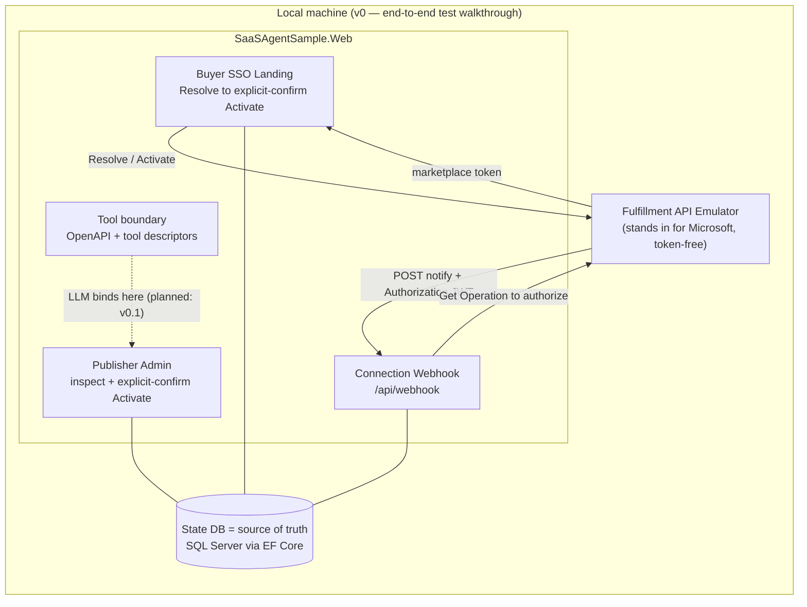

# marketplace-saas-agent-sample

> **Experimental teaching sample — work in progress.** An agent-ready reference for
> publishing and operating a **Microsoft Commercial Marketplace SaaS Offer** at
> **Tier-1 flat-rate** (a single fixed monthly price per subscription — no metered billing,
> no per-user quantity) on **.NET 10**. Not for production use.

> 🌐 日本語版の README は **[README.ja.md](README.ja.md)** をご覧ください。

Agent-assisted SaaS Offer fulfillment: a buyer **SSO landing page**
(Resolve → explicit-confirm Activate), a **connection webhook**, an **authoritative
subscription-state store**, and a **minimal publisher admin** — behind a language-agnostic
**tool boundary** (an OpenAPI surface that an LLM or agent can call into later) so a
model layer can be added without rewriting the **fulfillment plane** (the publisher-side
implementation: landing page, webhook, and state store). The official
[SaaS Accelerator](https://github.com/Azure/Commercial-Marketplace-SaaS-Accelerator) (MIT)
is used as a reference implementation (not a fork), and the
[Fulfillment API Emulator](https://github.com/microsoft/Commercial-Marketplace-SaaS-API-Emulator) (MIT)
drives Resolve/Activate/webhook with no real purchase.

New to marketplace SaaS? Start with the **[experience walkthrough](docs/walkthrough.md)** — a
plain-language map of who does what (buyer & publisher) and how it maps to this sample.

## Terminology

| Term | Meaning |
| --- | --- |
| **Tier-1 flat-rate** | A Microsoft pricing model: a single fixed monthly price per subscription (no metered billing, no per-user quantity). |
| **Fulfillment plane** | The publisher-side SaaS implementation: landing page, connection webhook, and subscription state store. |
| **Tool boundary** | An OpenAPI surface (+ tool descriptors) exposing publisher actions in a format an LLM or agent can call into. |
| **v0** | The initial version of this sample — all components run locally, no LLM agent loop yet. |
| **v0.1** | Planned next milestone: adds the LLM agent loop on top of the v0 base. |
| **L2 walkthrough** | An integration-level end-to-end proof: the app talks to a fulfillment API over real HTTP (emulated) and exercises the full subscription lifecycle. |
| **Synthetic L2** | The automated in-repo variant: an HTTP stub replaces the Docker-based emulator, so no Docker is required. |

## Architecture (v0 — initial version, runs entirely locally)



## Solution layout

| Project | Purpose |
| --- | --- |
| `src/SaaSAgentSample.Core` | Domain model (subscription, state, plan); infrastructure-agnostic |
| `src/SaaSAgentSample.Data` | EF Core state store (single source of truth); SQL Server / Azure SQL |
| `src/SaaSAgentSample.Fulfillment` | Fulfillment/Operations API v2 client + webhook validation (server-side) |
| `src/SaaSAgentSample.Web` | Buyer SSO landing, connection webhook, publisher admin, tool boundary |
| `tests/SaaSAgentSample.Tests` | Unit + integration (synthetic end-to-end) tests — see [L2 walkthrough](#l2-walkthrough-synthetic-fulfillment-lifecycle) |

## Prerequisites

- [.NET 10 SDK](https://dotnet.microsoft.com/download/dotnet/10.0)
- A database for the state store — choose based on your host architecture:
  - **x86-64 (Linux / macOS Intel / Windows x64)**: **SQL Server** via
    [Docker](https://www.docker.com/) using the bundled `docker-compose.yml`
    (image `mcr.microsoft.com/mssql/server:2022-latest`). SQL Server is the
    **authoritative database**; its schema is version-controlled via EF Core
    migrations.
  - **arm64 (Apple Silicon, Windows-on-ARM, Linux arm64)**: **SQLite** via the
    `Microsoft.EntityFrameworkCore.Sqlite` provider (schema mirrored with
    `EnsureCreated`, no migrations). Use this for local development only.
  - **Windows x64 (no Docker)**: SQL Server **LocalDB** works with the same
    connection-string switch as full SQL Server.
- The Fulfillment API Emulator for the end-to-end walkthrough (described below as the
  "L2 walkthrough" — an integration-level proof that exercises the full subscription lifecycle
  over HTTP using a token-free emulator as Microsoft's stand-in) — see
  [docs/l2-demo.md](docs/l2-demo.md). An automated proof runs in CI with no Docker;
  the manual path runs the emulator container from `docker-compose.yml`.

### Starting the local SQL Server (x86-64)

```bash
cp .env.example .env       # then edit MSSQL_SA_PASSWORD to a strong value
docker compose up -d sqlserver
```

### Database provider switch

Set the following configuration keys (e.g. in `appsettings.Development.json`
or via environment variables) to select the provider:

| `Database:Provider` | `Database:ConnectionString` example |
| --- | --- |
| `SqlServer` (default) | `Server=localhost,1433;Database=SaasAgentSample;User Id=sa;Password=...;TrustServerCertificate=True;` |
| `Sqlite` | `Data Source=./saas-agent-sample.db` |
| `InMemory` | *(ignored — used only for tests)* |

On startup the SQL Server path runs `DbContext.Database.Migrate()` (authoritative
migration in `src/SaaSAgentSample.Data/Persistence/Migrations/`). The SQLite
path runs `DbContext.Database.EnsureCreated()` so arm64 developers can iterate
without maintaining a separate migration history.

## Build & test

```bash
dotnet build SaaSAgentSample.slnx
dotnet test SaaSAgentSample.slnx
```

The default test run only exercises the SQLite / InMemory paths. To also run
the SQL Server integration tests locally, start the compose service above and
export a connection string:

```bash
export SQL_SERVER_CONNECTION='Server=localhost,1433;Database=SaasAgentSample;User Id=sa;Password=<your MSSQL_SA_PASSWORD>;TrustServerCertificate=True;'
dotnet test SaaSAgentSample.slnx
```

## Run the app

```bash
dotnet run --project src/SaaSAgentSample.Web
```

By default this uses the `Development` environment: SQLite state store, buyer
sign-in disabled (`Landing:RequireAuthentication=false`), the Fulfillment client
pointed at the local emulator, and unsigned webhook tokens accepted — so the whole
flow works locally without Entra or a real purchase. Endpoints:

| Path | What it is |
| --- | --- |
| `/?token=<purchase-token>` | Buyer SSO landing (Resolve → explicit-confirm Activate) |
| `/admin`, `/admin/{id}` | Publisher admin (inspect + explicit-confirm Activate) |
| `POST /api/webhook` | Connection webhook (server-side Entra JWT + Get Operation) |
| `/api/subscriptions`, `/api/subscriptions/{id}` | Tool boundary — read state (JSON) |
| `POST /api/subscriptions/{id}/activate` | Tool boundary — activate (`confirm=true` required) |
| `/api/tools` | Tool descriptors (function-calling schemas) |
| `/openapi/v1.json` | OpenAPI document for the tool boundary |

## Configuration reference

Bind from `appsettings*.json`, environment variables (`__` for nested keys), or
App Service settings. Secrets are **placeholders only** — never commit real values.

| Key | Purpose | Local default |
| --- | --- | --- |
| `Database:Provider` | `SqlServer` \| `Sqlite` \| `InMemory` | `Sqlite` |
| `Database:ConnectionString` | State store connection | SQLite file |
| `Landing:RequireAuthentication` | Require Entra sign-in for landing/admin | `false` (dev) |
| `AzureAd:*` | Buyer sign-in app (multitenant; authority `common`) | placeholder client id |
| `Fulfillment:BaseUrl` | Fulfillment API base (incl. `/api`) | emulator |
| `Fulfillment:ApiVersion` | API version | `2018-08-31` |
| `Fulfillment:Webhook:Audience` | Expected JWT audience = publisher app client id | placeholder |
| `Fulfillment:Webhook:ExpectedAppId` | Expected `appid`/`azp` claim | public Marketplace app id |
| `Fulfillment:Webhook:MetadataAddress` | Entra OpenID metadata for signing keys | — |
| `Fulfillment:Webhook:RequireSignedToken` | Enforce JWT signature (**true in prod**) | `false` (dev) |

## L2 walkthrough (synthetic fulfillment lifecycle)

Prove the fulfillment plumbing end to end — Resolve → Activate → webhook → state —
without a real purchase. **"L2"** here means an integration-level proof: the app runs
against a fulfillment API over real HTTP (emulated, not a mock), exercising the full
subscription lifecycle. The emulator stands in for Microsoft; no real purchase or Marketplace
token is required. An automated test drives the full lifecycle over real HTTP (runs in CI,
no Docker); a manual path runs the actual emulator in Docker. See
**[docs/l2-demo.md](docs/l2-demo.md)**.

```bash
dotnet test --filter FullyQualifiedName~SyntheticL2LifecycleTests
```

## Guardrails (non-negotiable)

- The **state DB is the single source of truth**; the model never invents entitlement/state.
- **State-changing actions require explicit confirmation.**
- **No purchase/bearer tokens, secrets, or unnecessary PII** in the model context or logs.
- **Webhook Authorization validation is server-side** (Entra JWT + Get Operation), never delegated to the model.

## Deploy

Target: Azure **App Service** (.NET 10) + **Azure SQL** in **West US 3**, with the app
connecting to the database **passwordless** via managed identity (no connection-string
secret). Provisioning is **human-authorized only** and is **not** performed by the agent.

The full walkthrough — provision, managed-identity SQL access, app settings, deploy, and
wiring the marketplace offer's landing page + connection webhook — is in
**[docs/deploy.md](docs/deploy.md)**.

## Further reading

- SaaS fulfillment APIs: <https://learn.microsoft.com/en-us/partner-center/marketplace-offers/pc-saas-fulfillment-apis>
- SaaS subscription life cycle: <https://learn.microsoft.com/en-us/partner-center/marketplace-offers/pc-saas-fulfillment-life-cycle>
- Implementing a webhook (JWT validation + Get Operation): <https://learn.microsoft.com/en-us/partner-center/marketplace-offers/pc-saas-fulfillment-webhook>
- Register a SaaS application: <https://learn.microsoft.com/en-us/partner-center/marketplace-offers/pc-saas-registration>
- Deploy an ASP.NET web app to App Service: <https://learn.microsoft.com/en-us/azure/app-service/quickstart-dotnetcore>
- Connect .NET apps to Azure SQL with managed identity: <https://learn.microsoft.com/en-us/azure/app-service/tutorial-connect-msi-sql-database>
- What is Azure SQL Database: <https://learn.microsoft.com/en-us/azure/azure-sql/database/sql-database-paas-overview?view=azuresql>
- .NET lifecycle (.NET 10 supported to 2028-11-14): <https://learn.microsoft.com/en-us/lifecycle/products/microsoft-net-and-net-core>

## License

[MIT](LICENSE).
