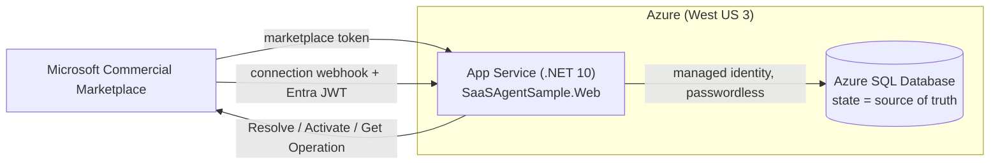

# Deploy to Azure (App Service + Azure SQL)

> **Human-authorized only.** The agent does **not** provision or deploy. This is a reference
> walkthrough; run it yourself after reviewing. All identifiers below are **placeholders** —
> never commit real tenant, subscription, publisher, or app IDs, or any secret.

Target topology for v0 (minimal footprint):

- **Azure App Service** (Linux, .NET 10) hosts `SaaSAgentSample.Web`.
- **Azure SQL Database** is the authoritative state store.
- **Managed identity** connects App Service → Azure SQL **passwordless** (no connection-string secret).
- Region: **West US 3** (prior L1/L2 provisioning experience).



## Prerequisites

- An Azure subscription and the [Azure CLI](https://learn.microsoft.com/en-us/cli/azure/install-azure-cli).
- A registered **Microsoft Entra application** for buyer sign-in and for the marketplace security
  token (see [Register a SaaS application](https://learn.microsoft.com/en-us/partner-center/marketplace-offers/pc-saas-registration)).
- A transactable SaaS offer in Partner Center (or the emulator for pre-Partner-Center testing).

## 1. Provision (illustrative)

```bash
# Placeholders — replace <...>. Do not paste real IDs/secrets into source control.
LOCATION=westus3
RG=<resource-group>
PLAN=<app-service-plan>
APP=<app-name>                 # becomes https://<app-name>.azurewebsites.net
SQLSERVER=<sql-server-name>
SQLDB=SaasAgentSample

az group create -n "$RG" -l "$LOCATION"

az appservice plan create -g "$RG" -n "$PLAN" --is-linux --sku B1
az webapp create -g "$RG" -p "$PLAN" -n "$APP" --runtime "DOTNETCORE:10.0"

az sql server create -g "$RG" -n "$SQLSERVER" -l "$LOCATION" --enable-ad-only-auth \
  --external-admin-principal-type User \
  --external-admin-name "<aad-admin-upn>" --external-admin-sid "<aad-admin-object-id>"
az sql db create -g "$RG" -s "$SQLSERVER" -n "$SQLDB" --service-objective S0
```

> Azure SQL is provisioned **Entra-only** (`--enable-ad-only-auth`) so there is no SQL password to
> manage. See [What is Azure SQL Database](https://learn.microsoft.com/en-us/azure/azure-sql/database/sql-database-paas-overview?view=azuresql).

## 2. Passwordless connection (managed identity)

Give the app a managed identity and grant it access to the database as a contained user. This
follows [Connect .NET apps to Azure SQL with managed identity](https://learn.microsoft.com/en-us/azure/app-service/tutorial-connect-msi-sql-database).

```bash
az webapp identity assign -g "$RG" -n "$APP"
```

Then, connected to the database as the Entra admin, create a user for the app's identity and grant
least-privilege roles:

```sql
CREATE USER [<app-name>] FROM EXTERNAL PROVIDER;
ALTER ROLE db_datareader ADD MEMBER [<app-name>];
ALTER ROLE db_datawriter ADD MEMBER [<app-name>];
ALTER ROLE db_ddladmin  ADD MEMBER [<app-name>];   -- needed for EF Core Migrate() on startup
```

The connection string carries **no secret** — authentication is the managed identity:

```
Server=tcp:<sql-server-name>.database.windows.net,1433;Database=SaasAgentSample;Authentication=Active Directory Default;Encrypt=True;
```

## 3. App settings

Set configuration on the App Service (App settings use `__` for nested keys). All IDs are placeholders.

```bash
az webapp config appsettings set -g "$RG" -n "$APP" --settings \
  Database__Provider=SqlServer \
  "Database__ConnectionString=Server=tcp:$SQLSERVER.database.windows.net,1433;Database=$SQLDB;Authentication=Active Directory Default;Encrypt=True;" \
  Landing__RequireAuthentication=true \
  AzureAd__Instance=https://login.microsoftonline.com/ \
  AzureAd__TenantId=common \
  AzureAd__ClientId=<landing-app-client-id> \
  Fulfillment__BaseUrl=https://marketplaceapi.microsoft.com/api \
  Fulfillment__ApiVersion=2018-08-31 \
  Fulfillment__Webhook__Audience=<publisher-app-client-id> \
  Fulfillment__Webhook__ExpectedAppId=20e940b3-4c07-4bc1-a733-45f7c7a3d0e3 \
  Fulfillment__Webhook__MetadataAddress=https://login.microsoftonline.com/common/v2.0/.well-known/openid-configuration \
  Fulfillment__Webhook__RequireSignedToken=true
```

Notes:

- `Fulfillment:Webhook:RequireSignedToken` **must be `true`** in production (the local `false` is for
  the token-free emulator only).
- `ExpectedAppId` defaults to the **public** Microsoft Marketplace app id `20e940b3-…` (a documented
  constant, not a secret).
- Prefer [Key Vault references](https://learn.microsoft.com/en-us/azure/app-service/app-service-key-vault-references)
  for any value you consider sensitive. Managed identity means there is **no database secret** to store.

## 4. Deploy the app

```bash
dotnet publish src/SaaSAgentSample.Web -c Release -o ./publish
cd publish && zip -r ../app.zip . && cd ..
az webapp deploy -g "$RG" -n "$APP" --src-path app.zip --type zip
```

On first start the SQL Server path runs the authoritative EF Core migration
(`Database.Migrate()`), creating the schema. See
[Deploy an ASP.NET web app](https://learn.microsoft.com/en-us/azure/app-service/quickstart-dotnetcore).

## 5. Wire up the marketplace offer (Partner Center)

In the SaaS offer's **Technical configuration**:

| Field | Value |
| --- | --- |
| Landing page URL | `https://<app-name>.azurewebsites.net/` |
| Connection webhook | `https://<app-name>.azurewebsites.net/api/webhook` |
| Microsoft Entra tenant ID | `<your-tenant-id>` |
| Microsoft Entra application ID | `<publisher-app-client-id>` |

The tenant/app IDs are the app registration used to authenticate to the fulfillment APIs
(see [Register a SaaS application](https://learn.microsoft.com/en-us/partner-center/marketplace-offers/pc-saas-registration)
and [Implementing a webhook](https://learn.microsoft.com/en-us/partner-center/marketplace-offers/pc-saas-fulfillment-webhook)).

## 6. Verify

- Browse `https://<app-name>.azurewebsites.net/admin` (sign-in required in production).
- Drive a purchase from Partner Center's preview or the emulator and confirm the subscription
  appears and transitions correctly.

## 7. Tear down

```bash
az group delete -n "$RG" --yes --no-wait
```

## Guardrails on Azure

- The **state DB remains the single source of truth**; nothing here changes that.
- **No secrets in source or app settings** where avoidable — managed identity for SQL, Key Vault
  references for anything else. IDs in this doc are placeholders.
- Webhook Authorization validation stays **server-side** (Entra JWT + Get Operation).

## Sources (fetched HTTP 200 on 2026-07-18)

- Deploy an ASP.NET web app to App Service: <https://learn.microsoft.com/en-us/azure/app-service/quickstart-dotnetcore>
- Connect .NET apps to Azure SQL with managed identity: <https://learn.microsoft.com/en-us/azure/app-service/tutorial-connect-msi-sql-database>
- What is Azure SQL Database: <https://learn.microsoft.com/en-us/azure/azure-sql/database/sql-database-paas-overview?view=azuresql>
- Register a SaaS application: <https://learn.microsoft.com/en-us/partner-center/marketplace-offers/pc-saas-registration>
- Implementing a webhook: <https://learn.microsoft.com/en-us/partner-center/marketplace-offers/pc-saas-fulfillment-webhook>
