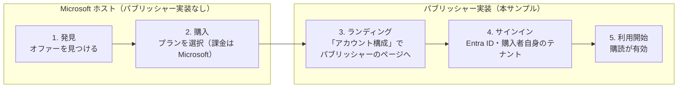
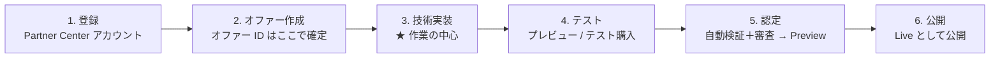
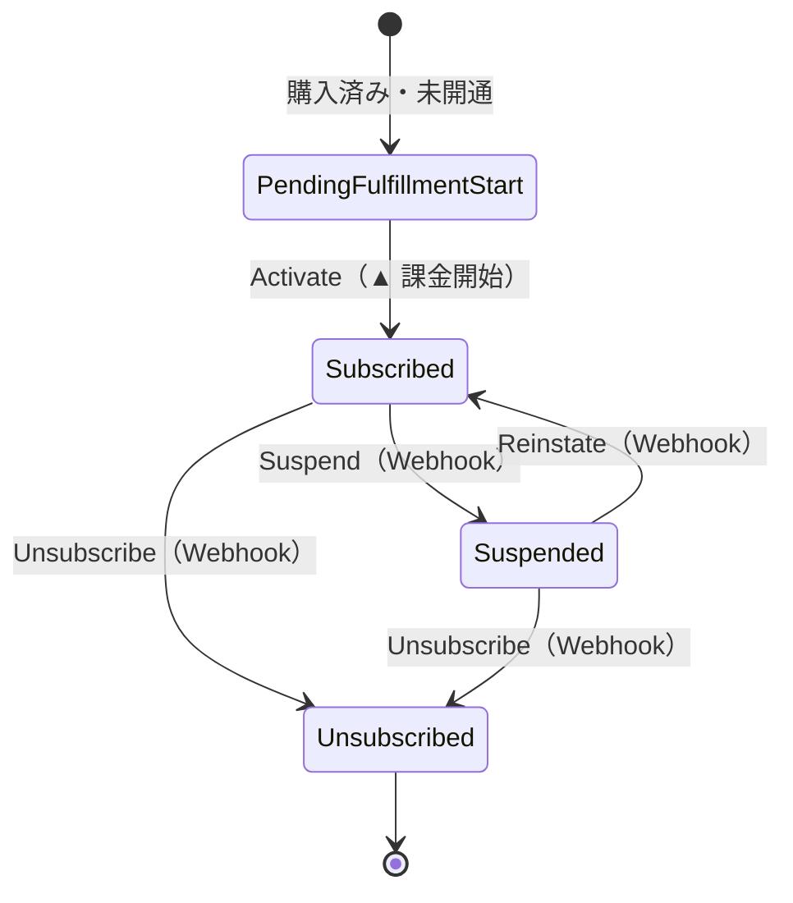
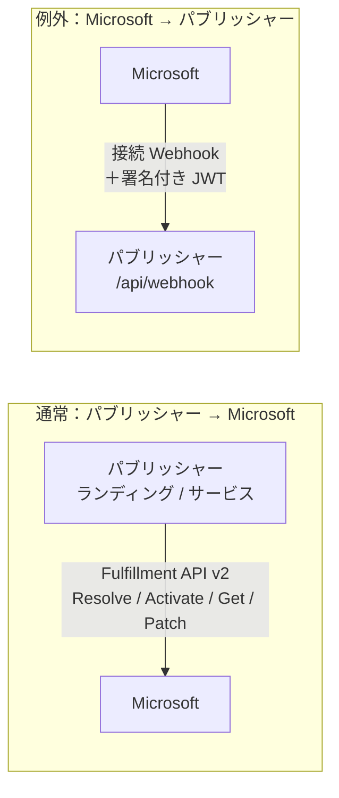

# 体験ウォークスルー：購入者とパブリッシャー

Microsoft 商用マーケットプレースで SaaS Offer が販売・運用されるとき、**誰が何をするのか**を平易に
地図化し、それが**本サンプル**のコードにどう対応するかを示します。コードを読む前にこれを読むと、
各パーツが*なぜ*存在するのかがつかめます。教材であり、公式ドキュメント（末尾にリンク）の代わりでは
ありません。

> 🌐 English: **[walkthrough.md](walkthrough.md)**

手法は**メタファ地図**です：登場人物と、彼らがやり取りする「引換券・名札」に名前を付け、購読の
ライフサイクルを1本の物語として語り、呼び出しの向きが反転する唯一の箇所を強調します。

> **クイック用語集** — 本ドキュメントで使う用語：
> - **v0**：本サンプルの初期バージョン（全コンポーネントをローカルで動作、LLM ループはまだなし）。
> - **v0.1**：次のマイルストーン（予定）。LLM エージェントループを追加。
> - **Tier-1 定額（flat-rate）**：購読ごとに月額固定価格を1つ（従量課金・ユーザー数課金なし）。
> - **ツール境界（Tool boundary）**：パブリッシャー操作を LLM/エージェントが呼び出せる OpenAPI サーフェス。
> - **L2 ウォークスルー**：統合レベルのエンドツーエンド実証 — トークン不要のエミュレーターを使い、実 HTTP 上で全購読ライフサイクルを駆動。
> - **合成 L2（Synthetic L2）**：自動化された in-repo バリアント。Docker エミュレーターを HTTP スタブで置換（Docker 不要）。
> - **L3**：実マーケットプレース購入・実購入者アカウントでのライブなエンドツーエンドテスト（本サンプルの対象外）。

---

## 3人の登場人物

| 登場人物 | たとえ | 役割 |
| --- | --- | --- |
| **Microsoft** | **お店** | マーケットプレースを運営：オファーの掲載/認定、購入の受付、**顧客への課金**、購読変更のパブリッシャーへの中継。 |
| **パブリッシャー（あなた）** | **メーカー** | SaaS Offer を作成・掲載。ランディングページと Webhook を実装し、購入後の購読状態を保持する。**これが本サンプルです。** |
| **購入者** | **お客さん** | マーケットプレースから購読する。通常はパブリッシャーとは**別テナント**に所属。 |

> 購入者は**別テナント**なので、ランディングページのサインインは**マルチテナント**でなければなりません
> （各購入者テナントが同意）。本サンプルではそれが `AzureAd`（authority `common`）のランディングアプリで、
> フルフィルメント API を呼ぶ**サービスアプリとは別物**です。

---

## 購入者の体験 — 5ステップの旅

パブリッシャーが最終的に実装するのは、*この*顧客体験です。

本サンプルでは、ステップ 3〜5 が**購入者 SSO ランディング**（`GET /?token=<purchase-token>`）です：
**Resolve** でトークンを復号し、プランを表示し、**明示的な確認**のうえで初めて **Activate** を呼びます。
購入後の変更（プラン変更・解約）はマーケットプレース側で発生し、**Webhook** 通知として届きます
（後述のライフサイクル参照）。

---

## パブリッシャーの旅 — 公開までの6フェーズ

フェーズ3が本サンプルの守備範囲です。フェーズ1〜2 と 5〜6 は Partner Center ポータルでの操作、
フェーズ4は**実購入なしで**フローを試す段階で、本サンプルは
[Fulfillment API Emulator](l2-demo.ja.md) でそれを行います。

> オファー ID／エイリアスは**作成時に確定し変更不可**。Live のオファーは削除できず、配布停止しかできません。
> （*Create a SaaS offer* 参照）

---

## Technical configuration — 4つの接点

オファーの **Technical configuration** では、4つの項目がマーケットプレースとパブリッシャー実装を
つなぎます。それぞれ本サンプルへの対応は次のとおり：

| Partner Center の項目 | 内容 | 本サンプルでは |
| --- | --- | --- |
| **Landing page URL** | 購入後に購入者が開くページ（Resolve → Activate）。24×7 稼働が必須。 | `GET /`（購入者 SSO ランディング） |
| **Connection webhook** | Microsoft が購読変更を POST するエンドポイント。24×7 稼働が必須。 | `POST /api/webhook` |
| **Microsoft Entra tenant ID** | Fulfillment API v2 を呼ぶ**サービスアプリ**のテナント。 | `AzureAd`／トークン設定（プレースホルダ） |
| **Microsoft Entra application ID** | Fulfillment API v2 を呼ぶ資格情報を持つ**サービスアプリ**。 | Fulfillment クライアント認証（プレースホルダ） |

> **サービスアプリ**（フルフィルメント API を呼ぶ）は、**ランディングアプリ**（マルチテナント、購入者
> サインイン用）とは別物です。この画面にはサービスアプリのテナント/アプリ ID のみを設定します。

---

## 購読ライフサイクル — 状態の物語

Microsoft は購読をライフサイクルとして管理し、パブリッシャーは各遷移に反応します。本サンプルの
権威ある状態ストアは、**公式の4状態**をそのままモデル化しています：

- **前半**（開通）は**ランディングページ**が駆動：Resolve → 明示確認 Activate。
- **後半**（変更／停止／再開／解約）は**接続 Webhook** が駆動。
- **自動開通**の購入は最初の状態を飛ばし、`Subscribed` から始まります。
- `ChangePlan` / `ChangeQuantity` は `Subscribed` のまま（v0＝初期のローカル専用版ではプラン変更は
  追跡し、数量は ack のみ。本サンプルは **Tier-1 定額**＝固定価格1つ・従量課金なしのため）。

本サンプルでは集約が**遷移を保護**（不正な遷移は拒否）し、状態が唯一の正本です — モデルがそれを
捏造することはありません。

---

## 呼び出しの向きと、やり取りされる「引換券・名札」

ほぼ全ては**パブリッシャー → Microsoft**です。**唯一**向きが逆なのが Webhook。

フローを流れる「券・名札」（記憶に残すためのたとえ）：

| 券・名札 | たとえ | 目的 | 本サンプルでは |
| --- | --- | --- | --- |
| **購入トークン** | 半券 | **Resolve** で購読詳細に引き換える | Resolve の `x-ms-marketplace-token` |
| **`id_token`** | 名札 | 購入者サインイン＝**認証** | ランディングのマルチテナントサインイン |
| **アクセストークン** | 業者証 | サービスアプリが Fulfillment API v2 を呼ぶ**認可** | API 呼び出しのベアラートークン |
| **署名付き JWT** | Microsoft の名札 | **Webhook** 呼び出しに付与。呼び出し元を証明 | サーバー側で検証 |

> **Webhook 検証はサーバー側で行い、モデルには一切委譲しません**：本サンプルは Entra JWT
> （署名/issuer/audience ＋ `appid`/`azp`。`20e940b3-4c07-4bc1-a733-45f7c7a3d0e3` は**公開**の
> Marketplace アプリ ID＝文書化された定数でありシークレットではない）を検証し、状態変更の前に
> **Get Operation** API で Microsoft 側の真実と照合します。

---

## 各パーツと本サンプルの対応（v0 スコープ）

| 概念 | 本サンプル |
| --- | --- |
| 購入者ランディング（Resolve → 明示 Activate） | `src/SaaSAgentSample.Web` — `GET /`, `LandingService` |
| 接続 Webhook（サーバー側2段） | `POST /api/webhook`, `WebhookService` + `IWebhookTokenValidator` |
| 権威ある購読状態（4状態） | `SaaSAgentSample.Core` 集約 + `SaaSAgentSample.Data` ストア |
| パブリッシャー管理（閲覧＋明示 Activate） | `/admin`, `/admin/{id}` |
| エージェントのツール境界（後で LLM 追加） | `/api/tools`, `/openapi/v1.json` — **ツール境界**：LLM が呼び出せる OpenAPI サーフェス（LLM ループは v0.1 予定） |
| 実購入なしのテスト | エミュレーター経由の [L2 ウォークスルー](l2-demo.ja.md) — **L2** = HTTP 上の統合レベル実証 |

**v0 スコープ（初期のローカル専用版）：** Tier-1 **定額**のみ（固定価格1つ）。
**v0 の対象外：** 従量課金／ユーザー数課金／実マーケットプレース購入（L3＝実購入者アカウントでの
ライブ E2E）／LLM エージェントループ（v0.1 予定）。実行・設定は [README.ja](../README.ja.md)、
人間承認前提の Azure デプロイは [docs/deploy.ja.md](deploy.ja.md) を参照。

---

## 出典（Microsoft Learn — HTTP 200 で取得確認）

2026-07-21 確認：

- Create a SaaS offer: <https://learn.microsoft.com/en-us/partner-center/marketplace-offers/create-new-saas-offer>
- Add technical details for a SaaS offer: <https://learn.microsoft.com/en-us/partner-center/marketplace-offers/create-new-saas-offer-technical>
- Review and publish an offer: <https://learn.microsoft.com/en-us/partner-center/marketplace-offers/review-publish-offer>

2026-07-18 確認：

- SaaS fulfillment APIs: <https://learn.microsoft.com/en-us/partner-center/marketplace-offers/pc-saas-fulfillment-apis>
- SaaS subscription life cycle: <https://learn.microsoft.com/en-us/partner-center/marketplace-offers/pc-saas-fulfillment-life-cycle>
- Implementing a webhook: <https://learn.microsoft.com/en-us/partner-center/marketplace-offers/pc-saas-fulfillment-webhook>
- Register a SaaS application: <https://learn.microsoft.com/en-us/partner-center/marketplace-offers/pc-saas-registration>
