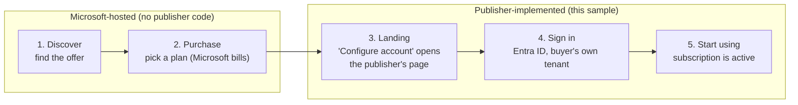
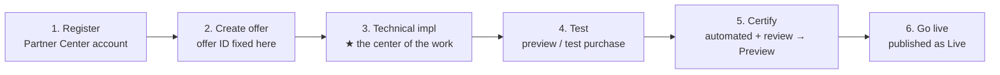
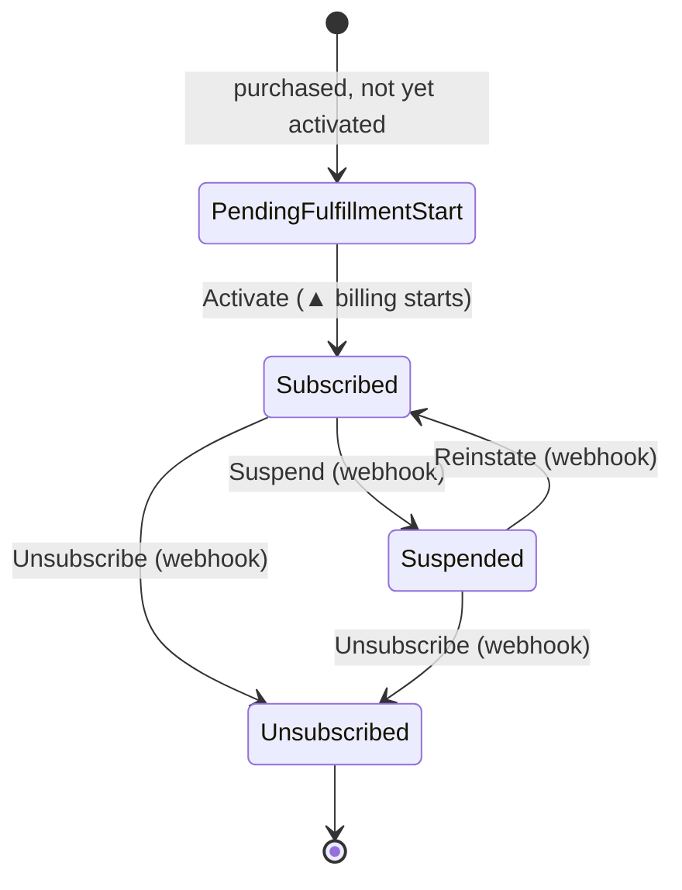
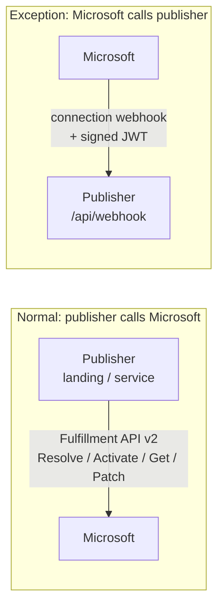

# Experience walkthrough: buyer & publisher

A plain-language map of **who does what** when a SaaS Offer is sold and operated on the Microsoft
Commercial Marketplace — and how each piece maps to **this sample's** code. Read this before the
code to understand *why* each part exists. It is a teaching aid, not a substitute for the official
docs (linked at the end).

> 🌐 日本語版: **[walkthrough.ja.md](walkthrough.ja.md)**

The approach is a **metaphor map**: name the actors and the "passes" they exchange, tell the
subscription lifecycle as one story, and highlight the single place where the call direction flips.

> **Quick glossary** — terms used in this document:
> - **v0**: the initial version of this sample (all components run locally).
> - **Tier-1 flat-rate**: a single fixed monthly price per subscription (no metered or per-user billing).
> - **L2 walkthrough**: an integration-level end-to-end proof — the app exercises the full subscription lifecycle over real HTTP using a token-free emulator.
> - **Synthetic L2**: the automated in-repo variant where an HTTP stub replaces the Docker emulator (no Docker needed).
> - **L3**: a live end-to-end test with a real marketplace purchase and real buyer account (out of scope for this sample).

---

## The three actors

| Actor | Metaphor | Role |
| --- | --- | --- |
| **Microsoft** | the **shop** | Runs the marketplace: lists/certifies offers, takes the purchase, **bills the customer**, and relays subscription changes to the publisher. |
| **Publisher (you)** | the **manufacturer** | Builds and lists the SaaS Offer. Implements the landing page and webhook, and owns the subscription's post-purchase state. **This is what this sample is.** |
| **Buyer** | the **customer** | Subscribes from the marketplace. Usually belongs to a **different tenant** than the publisher. |

> Because the buyer is in a **different tenant**, landing-page sign-in must be **multitenant** (each
> buyer tenant consents). In this sample that is the `AzureAd` (authority `common`) landing app,
> which is **separate** from the service app that calls the fulfillment APIs.

---

## Buyer experience — the five-step journey

What the publisher ultimately implements is *this* customer experience.

In this sample, steps 3–5 are the **buyer SSO landing** (`GET /?token=<purchase-token>`): it calls
**Resolve** to decode the token, shows the plan, and — only after an **explicit confirmation** —
calls **Activate**. Post-purchase changes (plan change, cancel) happen on the marketplace and arrive
as **webhook** notifications (see the lifecycle below).

---

## Publisher journey — six phases to go live

Phase 3 is where this sample lives. Phases 1–2 and 5–6 are Partner Center portal steps; phase 4 is
where you exercise the flow **without a real purchase** — this sample does that with the
[Fulfillment API Emulator](l2-demo.md).

> The offer ID/alias is **fixed at Create and cannot be changed**; a Live offer can't be deleted,
> only taken out of distribution. (See *Create a SaaS offer*.)

---

## Technical configuration — the four connection points

In the offer's **Technical configuration**, four fields wire the marketplace to the publisher's
implementation. Here is how each maps to this sample:

| Partner Center field | What it is | In this sample |
| --- | --- | --- |
| **Landing page URL** | Page the buyer opens after purchase (Resolve → Activate). Must run 24×7. | `GET /` (buyer SSO landing) |
| **Connection webhook** | Endpoint Microsoft POSTs subscription changes to. Must run 24×7. | `POST /api/webhook` |
| **Microsoft Entra tenant ID** | Tenant of the **service app** that calls Fulfillment API v2. | `AzureAd`/token config (placeholder) |
| **Microsoft Entra application ID** | The **service app** whose credentials call Fulfillment API v2. | Fulfillment client auth (placeholder) |

> The **service app** (calls the fulfillment APIs) is different from the **landing app** (multitenant,
> for buyer sign-in). Only the service app's tenant/app IDs go in this screen.

---

## Subscription lifecycle — the state story

Microsoft manages the subscription as a lifecycle; the publisher reacts to each transition. This
sample's authoritative state store models exactly the **four official states**:

- The **front half** (activation) is driven by the **landing page**: Resolve → explicit-confirm Activate.
- The **back half** (change / suspend / reinstate / unsubscribe) is driven by the **connection webhook**.
- An **auto-activated** purchase skips the first state and starts at `Subscribed`.
- `ChangePlan` / `ChangeQuantity` stay within `Subscribed` (in v0 — the initial local-only
version — plan changes are tracked; quantity is acknowledged only because this sample
implements **Tier-1 flat-rate**: one fixed price, no per-unit billing).

In this sample the aggregate **guards these transitions** (invalid ones are rejected), and state is
the single source of truth — the app never fabricates it.

---

## Call direction & the "passes" exchanged

Almost everything is **publisher → Microsoft**. The **only** reversed direction is the webhook.

The "passes" that travel through the flow (the metaphor that makes it stick):

| Pass | Metaphor | Purpose | In this sample |
| --- | --- | --- | --- |
| **Purchase token** | ticket stub | Redeemed at **Resolve** for the subscription details | `x-ms-marketplace-token` on Resolve |
| **`id_token`** | name badge | Buyer sign-in = **authentication** | landing multitenant sign-in |
| **Access token** | vendor pass | Service app's **authorization** to call Fulfillment API v2 | bearer token on API calls |
| **Signed JWT** | Microsoft's name badge | Attached to **webhook** calls; proves the caller | validated server-side |

> **Webhook validation is server-side**: this sample validates the
> Entra JWT (signature/issuer/audience + `appid`/`azp`, where `20e940b3-4c07-4bc1-a733-45f7c7a3d0e3`
> is the **public** Marketplace app id — a documented constant, not a secret), and then authorizes
> the payload against Microsoft's truth via the **Get Operation** API before changing any state.

---

## How the pieces map to this sample (v0 scope)

| Concept | This sample |
| --- | --- |
| Buyer landing (Resolve → explicit Activate) | `src/SaaSAgentSample.Web` — `GET /`, `LandingService` |
| Connection webhook (2-stage server-side) | `POST /api/webhook`, `WebhookService` + `IWebhookTokenValidator` |
| Authoritative subscription state (4 states) | `SaaSAgentSample.Core` aggregate + `SaaSAgentSample.Data` store |
| Publisher admin (inspect + explicit Activate) | `/admin`, `/admin/{id}` |
| Test without a real purchase | [L2 walkthrough](l2-demo.md) via the emulator — **L2** = integration-level end-to-end proof over HTTP |

**In v0 scope (initial local-only version):** Tier-1 **flat-rate** only (single fixed price).
**Out of scope in v0:** metered billing / per-user quantity / real marketplace purchase (L3 —
live end-to-end with a real buyer account). See the
[README](../README.md) for run and config, and [docs/deploy.md](deploy.md) for a
human-authorized Azure deployment.

---

## Sources (Microsoft Learn — fetched HTTP 200)

Verified 2026-07-21:

- Create a SaaS offer: <https://learn.microsoft.com/en-us/partner-center/marketplace-offers/create-new-saas-offer>
- Add technical details for a SaaS offer: <https://learn.microsoft.com/en-us/partner-center/marketplace-offers/create-new-saas-offer-technical>
- Review and publish an offer: <https://learn.microsoft.com/en-us/partner-center/marketplace-offers/review-publish-offer>

Verified 2026-07-18:

- SaaS fulfillment APIs: <https://learn.microsoft.com/en-us/partner-center/marketplace-offers/pc-saas-fulfillment-apis>
- SaaS subscription life cycle: <https://learn.microsoft.com/en-us/partner-center/marketplace-offers/pc-saas-fulfillment-life-cycle>
- Implementing a webhook: <https://learn.microsoft.com/en-us/partner-center/marketplace-offers/pc-saas-fulfillment-webhook>
- Register a SaaS application: <https://learn.microsoft.com/en-us/partner-center/marketplace-offers/pc-saas-registration>
